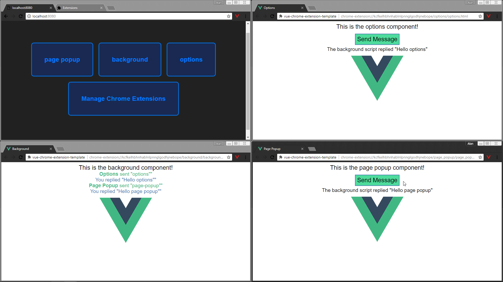

# Vue Chrome Extension Template

  

Vue webpack (v4) template for chrome extensions (supports sass out of the box). Automatically fills in your `manifest.json` and creates properly sized icons so you don't have to. In development mode it also creates an `index.html` at the root of the server for easily navigating between the parts of your extentions with links to the real extension pages in chrome (e.g. `chrome-extension://your-extension-id/popup/popup.html`) which means they can communicate between eachother properly!

The webpack config is also easy to customize if you want to changes the input/output locations and structure.

The only thing you have to edit are the permissions of the chrome extension depending on what you need. `declarativeContent` is on by default so the demo works (the icon should flash red if you're on a `chrome-extension` page or `localhost`). Additionally the `tabs` permission is turned on for development only if it doesn't already exist so that the `localhost/index.html` page redirects you properly. Also if using `content_scripts`, you should ideally specify those manually, see note below project structure.

**Note: This template is sort of a WIP. Parts I have not used are not completely tested and I'm not a webpack expert although I do understand it much better now I've made this.**

# Project Structure

```bash
├──.vscode # Debug configurations
├──dist # Build directory / Extension files
├──src
	├── assets # Assets can be required/accessed with @assets
	├── icons # If named correctly, icons will be automatically resized and appended to manifest.json.
		# accepted names: icon, browser-action-icon, or page-action-icon
		# [accepted name]-iconsize will override (svg overrides will also be resized properly)
		# all icons are auto converted to png
	├── manifest.json # Override any automatically set properties (except file/icon locations)
	├── parts # Contains main extension parts
		├── global_styles.scss # Example global style shared between parts of the extension.
		# EXTENSION COMPONENTS
		├── background # the page/script that runs in the background controlling the extension
		├── page_popup # For page_action, if using page_action, popup (browser_action) can't be used.
		├── popup # browser_action
		├── options
		├── devtools # Untested but should work.
		# SPECIAL FOLDERS
		├── scripts # Untested, but should get properly processed by webpack and injected into manifest.json
		├── content_scripts # Similar to above, but styles should also get processed.
	├── index.ejs #(development mode only) Creates the index.html with links to the extension's parts.
	├── development_content_script.js #(development mode only) Allows us to open chrome urls, see note.
├── secrets.json # To access secrets use @secrets e.g. `import secrets from "@secrets"`
├── webpack.config.js
├── configuration_helper.js # Used in webpack config to produce the manigest.json, output paths can be modified from here.
├── package.json # name/description from package.json are copied to manifest.json if none exist.
```

## Notes

- For `content_scripts` the template though will try to add them if they don't exist but the matches property will be set `["<all_url>"]`. You don't have to manually specify css with the same name as the js though.
- `background` can be just a js file, instead of a full page. Template tries to check this and act accordingly.
- Because chrome doesn't allow opening any of it's `chrome://` or `chrome-extensions://` pages from web pages or even content scripts, what I've done is create a development only content script that listens for clicks on the localhost page and sends a message to our background script to open a chrome tab, this way, chrome allows opening these types of urls. Unfortunately this means you must have the listener handle this in the background script. They are stripped from production by `string-replace-loader`. It will remove any `<dev block></dev block>` comment blocks (including the line they start on) and the code between them from production. Can be used to strip other stuff if you want.

# Install Instructions

1. Download / `git clone https://github.com/AlansCodeLog/vue-chrome-extension-template`

2. `npm install`

3. Run one of the following.

	`npm run dev` - Starts a server at http://localhost:8080 by default. Writes files to disk so you can also load them in chrome.

	`npm run dev:server` - Only starts the server. Does not write files to disk. You won't be able to load the extension in chrome. The index file will redirect to the relative html pages. They can't communicate between eachother.

	`npm run dev:build` - Opposite of `dev:server`, no server, writes to disk only. Only difference with `build` is it runs in development mode.

	`npm run build` - Builds the extension.

4. If building or using an npm script that writes to disk, in chrome, turn on developer mode and load the dist folder as an unpacked extension.

All dev scripts use nodemon to also watch for webpack config or package.json changes, hence the `script:dev:*` scripts which you can ignore, it's just to seperate the webpack command logic from nodemon's. I don't like how webpack's `--open` opens a tab everytime nodemon needs to restart it complete, so the dev scripts starts localhost once.

Additionally vscode debug configurations are provided both to step through the extension code and debug any webpack problems.